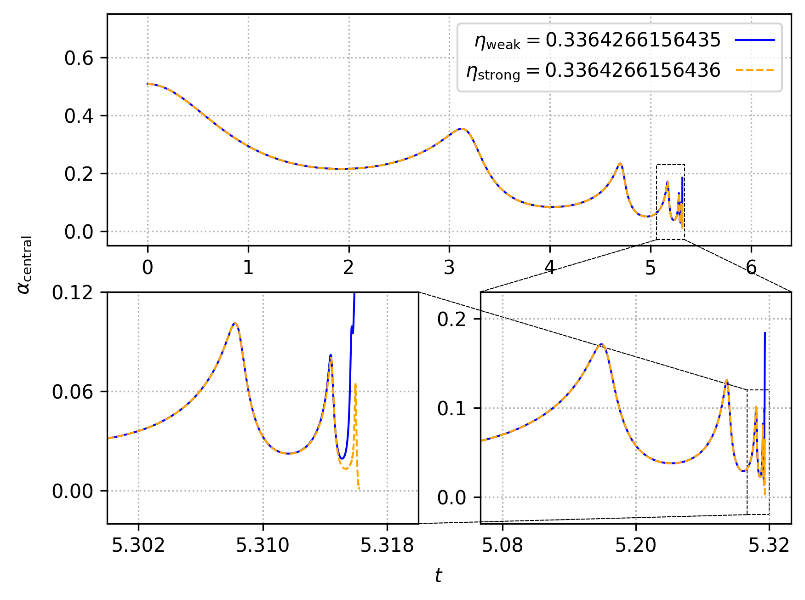

# SFcollapse1D
## Copyright (c) 2020, Leonardo Werneck
### Licensed under the GNU General License v3.0 or later (see LICENSE file for details)

This is a short, user-friendly, and well-documented code to study the gravitational collapse of massless scalar fields in spherical symmetry. It uses the ADM formalism and follows the original seminal study of [Matt Choptuik in 1993](https://journals.aps.org/prl/abstract/10.1103/PhysRevLett.70.9).

# Compilation

## General remarks

To compile the code you will need a `C++` compiler. I use [gcc](https://gcc.gnu.org/) and thus that is the default behaviour of the `Makefile`. If you wish to use a different compiler, then you must change the `CXX` variable inside the `Makefile`. The code also makes use of [`OpenMP`](https://www.openmp.org/), but if you do not want it or do not have it, simply remove the `-fopenmp` flag from the `Makefile`. Finally, if you choose to change the `-O2` flag to `-Ofast`, the code will still work, but the NaN checker function will break.

## Compilation of the code

To compile the code, go to the root directory and type

`$: make`

Compilation can be made faster, while still being safe on memory, by running

`$: make -j`

This will create the `SFcollapse1D` executable, while also creating the `obj/` and `out/` directories.

## Compilation of the documentation

To compile the documentation, go to the `doc/` directory and type

`$: make`

It will take a few seconds to compile the documentation, which will generate the file `SFcollapse1D.pdf`.

# Running an example

To run a simple example, which will ensure that the code has compiled properly, type

`$: ./SFcollapse1D 200 10 10 0.2 0.3`

The entire run should take less than 10 seconds. If you have `gnuplot` installed *and* the `gif` terminal, go to the `animations/` directory and type

`$: gnuplot -e "which_var='scalarfield'" anim.gp`

This should produce the following `.gif` animation:

## Production quality results

For the sake of those wishing to reproduce results from our production
runs, we provide a script which will help the user get to some of our
published results very quickly. In particular, after running `make`, one
can then run

`$: ./runscript.sh`

and wait for the 30-60 minutes (depending on your system) that is
required to generate the following plot, which reproduces Figure 2 in
[Werneck *et al.* (2021)](https://arxiv.org/pdf/2106.06553.pdf).

